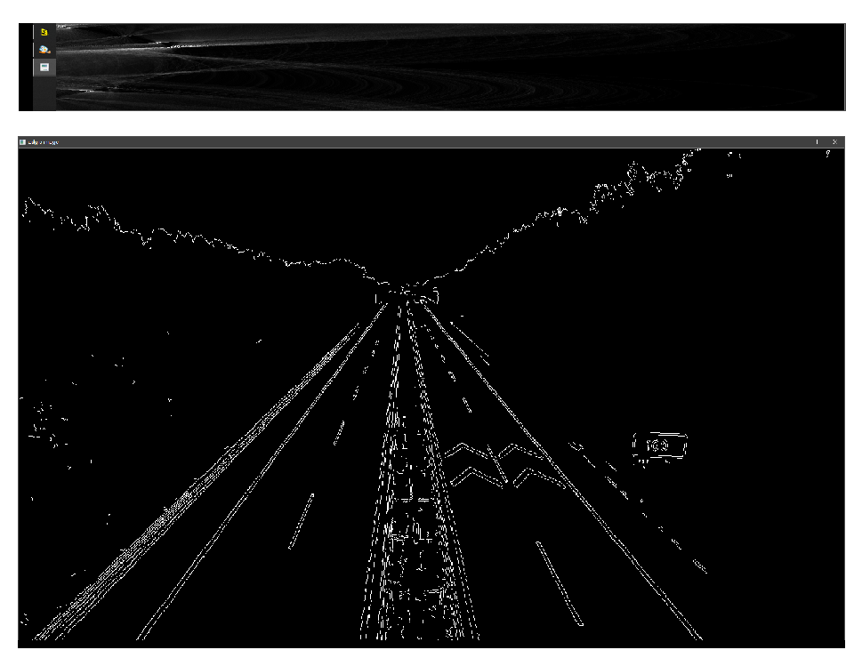

# 基于hough变换检测直线和圆


## 一、功能

1. 自己实现直线和圆的检测算法
2. 在原图上显示最终的检测结果
3. 单独显示一些关键的中间结果
4. 需要对coin,seal,highway进行调试

## 二、软件说明

### 1) 环境依赖

+ opencv3.4
+  mingw64 (写代码时采用的编译器, 也可以采用其他的)

### 2) 编译项目	

+ 修改makefile文件中的`INCLUDE_PATH`和`LIB_PATH`,改为本机opencv的路径
+ 输入`make`或者`mingw32-make`即可编译

### 3) 运行程序

​		程序在终端中执行, 需要命令行传参, 根据检测需求的不同需要不同的参数(以下假设可执行程序名为a.exe)

+ 检测圆 `./a.exe -c ./hw-coin.JPG`
+ 检测直线 `./a.exe -l ./hw-highway.JPG`

> 程序执行后, 会依次显示经过canny检测提取的边缘图, hough变换的参数空间图和绘制了提取形状的结果图


## 三、算法实现

### 1) 提取过程

1. 使用blur和canny算子提取图片的边缘, 并将结果转为二值图①
 2. - 对于直线检测, 将①图中提取的边缘点, 根据以下公式将θ和r所在的二维空间进行投票
    $$
      x*cosθ+y*sinθ = r
     $$
     
   - 对于圆检测, 将①图中提取的边缘点, 根据以下公式对a,b,r所在的三维空间进行投票
   
     其中, a,b,r分别为圆心的横、纵坐标和半径(θ取[θ|0<=θ<360,θ=4k])
$$
a = x + cosθ*r
$$

$$
     b = y + sinθ*r
$$

3. 将投票进行投票, 设置一定的阈值, 选出投票数大于阈值的参数对象作为检测结果
4. 对检测结果进行必要的优化
5. 将结果在原图中绘制出来

### 2) 核心算法

 1. 直线参数空间映射

    > 实现思想: 对于边缘点(x,y), 将θ从0~180度遍历,根据 r = x*cosθ + y*sinθ计算对应的r, 核心代码如下

    ```c++
     for(int y=0; y<image_h;y++){
            for(int x=0; x< image_w; x++){
                if(image.data[y*image_w + x] > 250)
                {
                    // x*cosθ + y*sinθ = r
                    for(int angle = 0; angle<accu_w; angle++){
                        //参数空间转换
                        double angle_rad = (double) angle * DEG2RAD;
                        int r = (double)(x-x_center)*cos(angle_rad) + (double)(y-y_center)*sin(angle_rad);
                        accu.data[(int)((r+max_r)*180.0 + angle)] += 1;
                    }
                }
            }
        }
    ```

2. 圆参数空间的映射

   > 实现思想: 对于边缘点(x,y),将r从MINR~HW/2遍历, 根据以下公式计算对应的a,b,其中MINR为检测的圆心的最小值,HW/2为图像的最小半径. θ遍历0-360度,步长为6
   > $$
   >  a = x + cosθ*r
   > $$
   > $$
   > b = y + sinθ*r
   > $$
   > 在做实验的过程中, 我查阅了很多资料, 其中提到通过计算边缘点(x,y)的梯度值来确定θ的值. 经过我的尝试, 虽然这样在投票的以及统计的时候能够节约时间, 但是在检测结果上却并不理想, 所以我的实现是采取遍历投票的方式,核心代码如下:

   ​	

   ```c++
   for (...){	//细节省略了,具体参见源代码
           for (...){
               if (image.data[y * image_w + x] > 250){
                   for(int r=0;r<r_range;r+=2){                  
                       for(int i = 0;i<divide;i++)
                       {
                           // double angle_rad = angle*DEG2RAD;
                           int a = x - x_offset[i];
                           int b = y - y_offset[i];
                           }
                       }
                   }
               }
           }
   ```

3. 提取结果的优化

   >需要优化的原因: 因为在参数空间中, 投票数较多的点往往是扎堆的, 为了避免最后识别的圆都是密集在一起的, 所以只取局域2MASK*2MASK范围内最大的点为有效点.

   ​		**优化算法1:**  采用一个MASK*MASK的掩码, 参数空间上的点只有满足以下两点, 才能作为最终结果

   + 票数超过阈值
   + 在附近MASK*MASK的区域上, 没有其他的点票数比它多

   ​		核心代码如下:

   ```c++
   for(int i = -MASK;i<=MASK;i++)
   {
       for(int j=-MASK;j<=MASK;j++){
           //确保检测值不越界
           if(x+i>=0 && x+i<image_w && y+j>=0 && y+j<image_h){
               ... //细节省略了,具体参考源代码
               if( ...)
               {
                   flag = true;
                   i = j = 7; //找到周围点比当前点票数多, 直接跳出循环
               }
           }
       } 
   }
   // 找到周围点比当前点票数多, 直接跳出循环
   if(flag) continue;
   circles.push_back(std::pair<cv::Point,int>(cv::Point(x,y),r+MINR));
   ```

   

   ​       **优化算法2:**  与之前选出的点进行比较, 如果有相似的点选出了, 则该点不重复记录(两者选其一,选票数较多的)

   ​		核心代码如下:

   ​		

   ```c++
   std::vector<std::pair<cv::Point,int> >::iterator i;
   bool flag = true; 
   for(i = circles.begin();i != circles.end();i++){
       if(x-i->first.x <= MASK && y-i->first.y <= MASK && r - (i->second-MINR) <=MASK){
          ... //细节省略了
           //当前点比以前添加的点更好, 则更新结果
           if(accu.data[index] > (int)accu.data[index1]){
               i->first.x = x;
               i->first.y = y;
               i->second = r+MINR;
           }
           flag = false;
           break;
       }
   }
   if(flag) circles.push_back(std::pair<cv::Point,int>(cv::Point(x,y),r+MINR));
   ```

## 四、结果分析

### 1) 直线提取

hw-highway原图:


中间图:上面为参数空间图, 下面为边缘检测图

> 结果图:(可以发现, 基本的长直线都能检测出来)


额外附上其他的识别结果:


### 2)  圆提取

how-coin原图:


中间图:上面为边缘检测图, 下面为参数空间图


其他图的结果如下:


> 可以观察到, 基本上所有的圆都能检测出来


